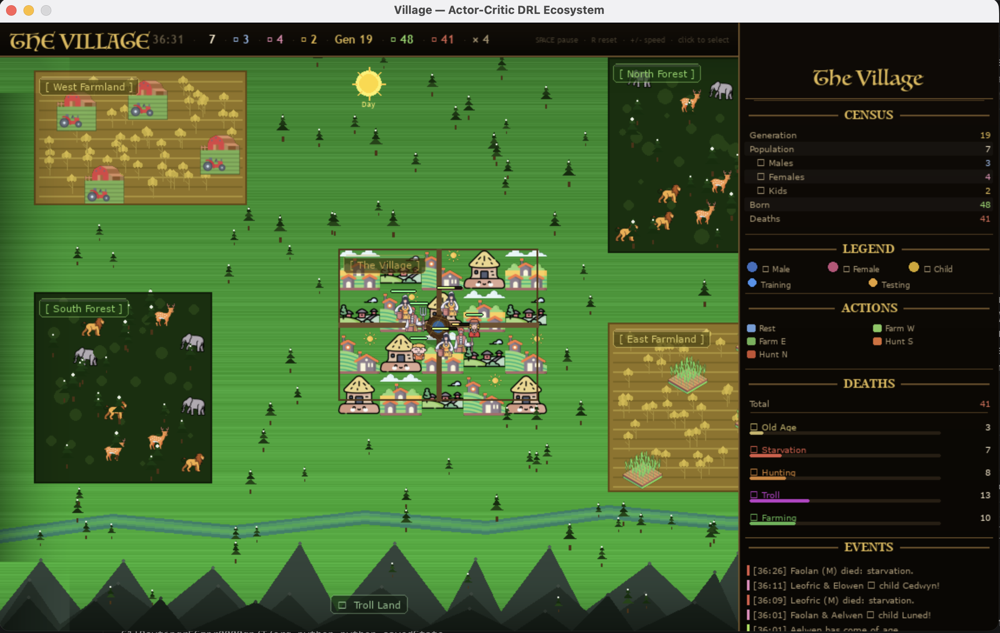
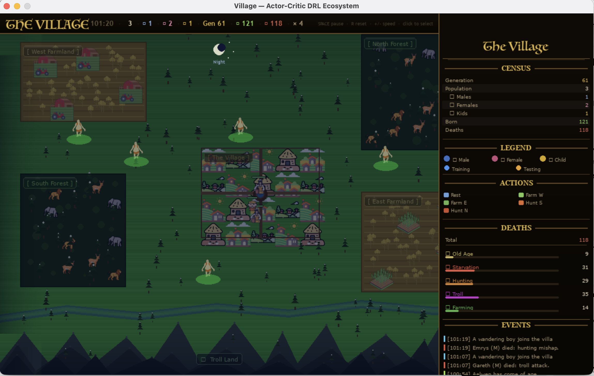

# VillageSim — PPO Actor-Critic DRL Ecosystem

A living village simulation where every villager is an independent **Actor-Critic reinforcement learning agent** built from scratch in pure NumPy. Villagers explore, learn, age, reproduce, and die. Children inherit neural weights and memories from both parents. Knowledge accumulates across generations through a shared **species memory pool**. Emergent behaviour arises purely from the RL policies — no rules, no scripted AI.

---

## Screenshots

| Day | Night |
|-----|-------|
|  |  |

During the day villagers farm and rest. At night, trolls emerge from the mountains — villagers that venture outside the village take heavy damage and risk death.

---

## Quick Start

```bash
pip install -r requirements.txt
python main.py
```

Requires **Python 3.10+** and **pygame 2.6+**.

---

## Controls

| Key / Input | Action |
|-------------|--------|
| `Space` | Pause / resume |
| `R` | Full reset |
| `+` / `=` | Increase simulation speed (up to 20×) |
| `-` | Decrease simulation speed |
| Speed slider | Drag in the top-right panel to set speed directly |
| `Left click` | Select a villager — shows live policy tooltip |
| `Esc` / `Q` | Quit |

---

## What's Happening on Screen

The **left panel** is the simulated world. The **right panel** is a live dashboard showing:

- **Census** — population breakdown (males, females, children), generation, total born/deaths
- **Legend** — colour key for villager types and RL phase (training/testing)
- **Actions** — colour key for the five possible actions
- **Deaths** — total deaths broken down by cause (Old Age, Starvation, Hunting, Troll Attack, Farming Exhaustion)
- **Events log** — births, deaths, reproduction events, and coming-of-age

Each villager is rendered as a **pixel-art sprite** (male/female adult or boy/girl) with:
- A movement trail
- A health bar above their head (green → yellow → red)
- An emotion symbol for key life events (♥ reproduction, ★ coming-of-age, ? wanderer arrival)
- A live policy tooltip when selected (click to select)

---

## How It Works

### The World

Five zones define the map:

| Zone | Activity | Zone Health Effect | Passive Drain | Risk |
|------|----------|--------------------|---------------|------|
| Village (centre) | Rest — regens health | +3.0 hp/s | −0.8 hp/s | None |
| Farm West / East | Farming — feeds hunger | −0.1 hp/s | −0.8 hp/s | Low |
| Hunt South / North | Hunting — high reward, high risk | −3.5 hp/s | −0.8 hp/s | High |
| Wild (elsewhere) | Wandering — slight drain | +0.3 hp/s | −0.8 hp/s | None |

A universal passive drain of **0.8 hp/s** always applies on top of zone effects.

### Day / Night Cycle

One full cycle = **280 sim-seconds** (≈70 real-seconds at default 4× speed):

| Phase | Sim-seconds | Real-seconds (4×) | Danger |
|-------|-------------|-------------------|--------|
| Dawn | 0 – 40 | ≈10 s | Fading 1→0 |
| Day | 40 – 120 | ≈20 s | 0 (safe) |
| Twilight | 120 – 160 | ≈10 s | Rising 0→1 |
| Night | 160 – 280 | ≈30 s | 1 (full danger) |

- A sun/moon indicator at the top-centre of the map tracks the cycle.
- At twilight/night, a dark blue overlay fades in over the world.
- Villagers outside the village re-evaluate their action immediately when twilight starts.
- **Trolls** emerge 20 sim-seconds (≈5 real-sec) into night and return 20 sim-seconds (≈5 real-sec) before dawn. Any villager caught outside the village takes **12 hp/s** of troll damage.

### Hunger

- Villagers start getting hungry after **120 sim-seconds** without eating.
- Eating requires spending at least 1 continuous sim-second inside a **farm or hunt zone**.
- A hungry villager loses an additional **3.5 hp/s**. Even inside the village, prolonged starvation is lethal.
- The RL reward for farming is **3× higher** when the villager is hungry, teaching agents to seek food proactively.

### Lifecycle

| Stage | Duration | Notes |
|-------|----------|-------|
| Childhood | 0 – 60 sim-sec | Cannot act independently; gains health from nearby parents |
| Adulthood | 60 sim-sec – death | Full RL agent; can reproduce |
| Old age | 300 – 600 sim-sec | Natural death window |

**Death causes tracked:** Old Age, Starvation, Hunting Mishap (risk ≥ 100%), Troll Attack, Farming Exhaustion.

If a gender goes extinct and no children remain, a wanderer arrives from off-screen and the generation counter increments.

---

## The RL Brain

### Architecture (`drl.py`)

Each villager owns one `ActorCritic` instance — a two-head neural network implemented in **pure NumPy** (no PyTorch, no TensorFlow):

```
State (11 dims) → Hidden (24 neurons, ReLU) → Actor head  → softmax over 5 actions
                                             → Critic head → scalar state-value estimate
```

### State Vector

| Index | Feature | Why it matters |
|-------|---------|----------------|
| 0 | `health / 100` | Urgency signal |
| 1 | `risk / 100` | Danger awareness |
| 2 | `age / max_age` | Proximity to death |
| 3 | `is_child` | Capability gate |
| 4 | `has_kid` | Parenting context |
| 5 | Kids nearby | Feeding opportunity |
| 6 | Potential mate nearby | Reproduction signal |
| 7 | Sex cooldown active | Reproduction readiness |
| 8 | `current_action / 4` | Inertia / momentum |
| 9 | `hunger_frac` | Food urgency (0–1, clipped at 2× threshold) |
| 10 | `is_night` | Day/night danger level (0.0 = safe, 1.0 = full night) |

### Actions

| Index | Action | Zone | Reward shaping |
|-------|--------|------|----------------|
| 0 | Rest | Village | 0.4× at day, 3.5× at full night; ×0.2 when hungry |
| 1 | Farm West | Crop W | 3× when hungry, 0.08× baseline; scales down as danger rises |
| 2 | Farm East | Crop E | 3× when hungry, 0.08× baseline; scales down as danger rises |
| 3 | Hunt South | Hunt S | 0.35× reward during day, 0.05× at night |
| 4 | Hunt North | Hunt N | 0.35× reward during day, 0.05× at night |

Additional reward shaping applied every tick:
- **Hunger penalty** — `−(1.0 + 2.0 × danger)` per sim-second while hungry (−1.0 at day, up to −3.0 at full night)
- **Outside-village danger penalty** — `−1.5 × danger` per sim-second when not in the village
- **Survival bonus** — `+0.15` per sim-second for staying alive

This pushes agents toward: *farm when hungry → rest in village at night → avoid hunting at night*.

### Training

Each villager alternates between phases:
- **Training phase** (60 sim-sec) — stochastic policy, experiences stored in replay buffer
- **Testing phase** (30 sim-sec) — greedy (argmax) policy, evaluates learned behaviour

At each phase boundary, a **PPO (Proximal Policy Optimisation) gradient update** runs over a mini-batch of recent transitions for K epochs:
- **Critic loss** — mean-squared TD error (coefficient `c1 = 0.5`)
- **Actor loss** — clipped surrogate objective (ε = 0.2) to prevent destructive policy updates
- **Entropy bonus** — encourages exploration (coefficient `c2 = 0.01`)
- **K epochs** — 4 gradient passes per batch

### Knowledge Transfer

On reproduction, the child brain is built by `parent_a.brain.breed(parent_b.brain)`:

1. **Weight crossover** — each weight independently drawn from either parent's matrix
2. **Gaussian mutation** — ~12% of weights perturbed with small random noise
3. **Parent memory seeding** — child inherits the last 20 transitions from each parent
4. **Species pool seeding** — child draws 30 random transitions from the collective species memory pool

### Species Memory Pool

When a villager dies, its **entire replay buffer** is donated to a shared species pool (capacity 2000 transitions). Every newborn draws from this pool at birth, so hard-won survival knowledge — including what killed past villagers — propagates to future generations even without direct parent–child lineage.

---

## Data Logging (`logger.py`)

Every 100 sim-seconds (≈25 real-sec at 4×), the simulation appends a row to `sim_log.csv`:

```
sim_time_s, real_time_s, generation, population, males, females, children,
total_born, total_deaths, deaths_old_age, deaths_starvation,
deaths_hunting, deaths_troll, deaths_farming
```

Use this for post-run analysis:

```python
import pandas as pd
df = pd.read_csv("sim_log.csv", comment="#")
df.plot(x="sim_time_s", y="population")
```

---

## Project Structure

```
VillageSim/
├── main.py          # Entry point, event loop, keyboard / mouse / slider handling
├── simulation.py    # Villager class, Troll class, World engine
├── drl.py           # ActorCritic network, ReplayBuffer, breed()
├── renderer.py      # All pygame rendering — world, sprites, trolls, UI panel
├── helpers.py       # Geometry utilities, particle system, tree drawing
├── logger.py        # CSV data logger for post-run analysis
├── config.py        # Every tunable constant — tweak here, not in logic files
├── requirements.txt
└── assets/          # Sprite icons (villagers, farm, troll, animals)
```

---

## Tuning (`config.py`)

| Constant | Default | Effect |
|----------|---------|--------|
| `HUNT_RISK_BASE` | 7.0 | How fast hunting risk accumulates |
| `TROLL_ATTACK_DRAIN` | 12.0 | HP/sec damage from trolls |
| `TROLL_COUNT` | 5 | Number of trolls that emerge at night |
| `HUNGER_THRESHOLD` | 120.0 | Sim-seconds before hunger kicks in (~30 real-sec at 4×) |
| `HUNGER_DRAIN` | 3.5 | HP/sec lost while hungry |
| `AC_LEARNING_RATE` | 0.018 | Neural network update step size |
| `AC_MUTATION_RATE` | 0.12 | Fraction of weights mutated in each child |
| `AC_MUTATION_STD` | 0.08 | Noise magnitude per mutation |
| `AC_PPO_EPSILON` | 0.2 | PPO clip ratio ε |
| `AC_PPO_K_EPOCHS` | 4 | Gradient passes per PPO update |
| `AC_INHERIT_SPECIES` | 30 | Species pool samples drawn at birth |
| `MAX_VILLAGERS` | 20 | Hard cap on simultaneous population |
| `DAY_DURATION` | 160.0 | Sim-seconds of daylight per cycle (≈40 real-sec at 4×) |
| `NIGHT_DURATION` | 120.0 | Sim-seconds of night per cycle (≈30 real-sec at 4×) |
| `TWILIGHT_DURATION` | 40.0 | Sim-seconds of twilight/dusk transition (≈10 real-sec at 4×) |
| `DAWN_DURATION` | 40.0 | Sim-seconds of dawn transition (≈10 real-sec at 4×) |
| `SIM_SPEED_DEFAULT` | 4 | Sim-seconds per real-second at startup |

---

## Dependencies

```
pygame==2.6.1
numpy>=1.26.0
```

No other dependencies. The neural network is plain NumPy — no ML framework required.
